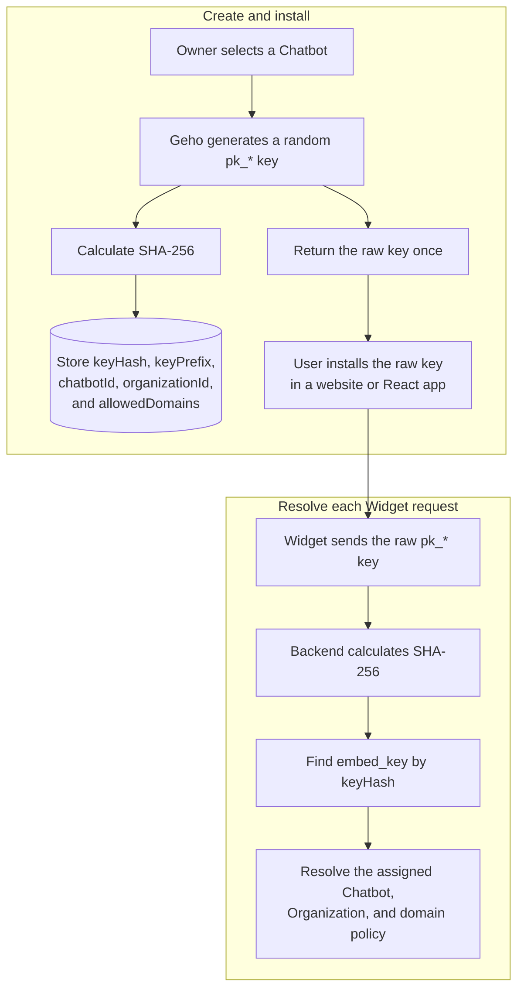
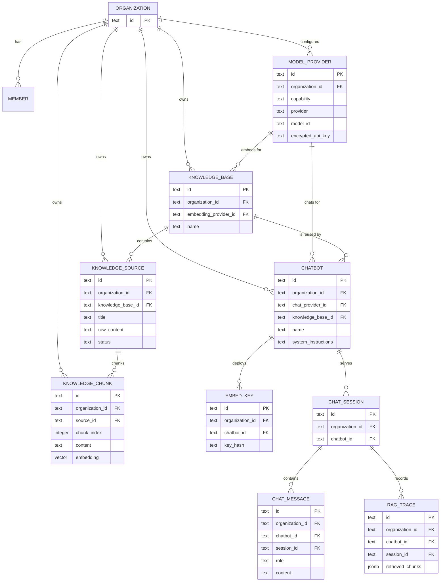
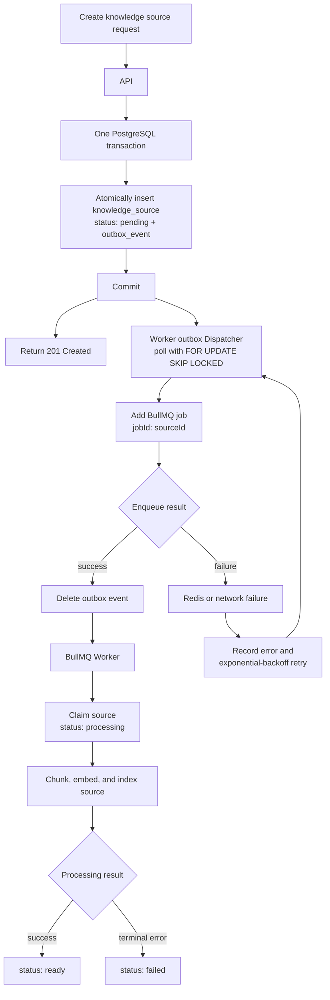
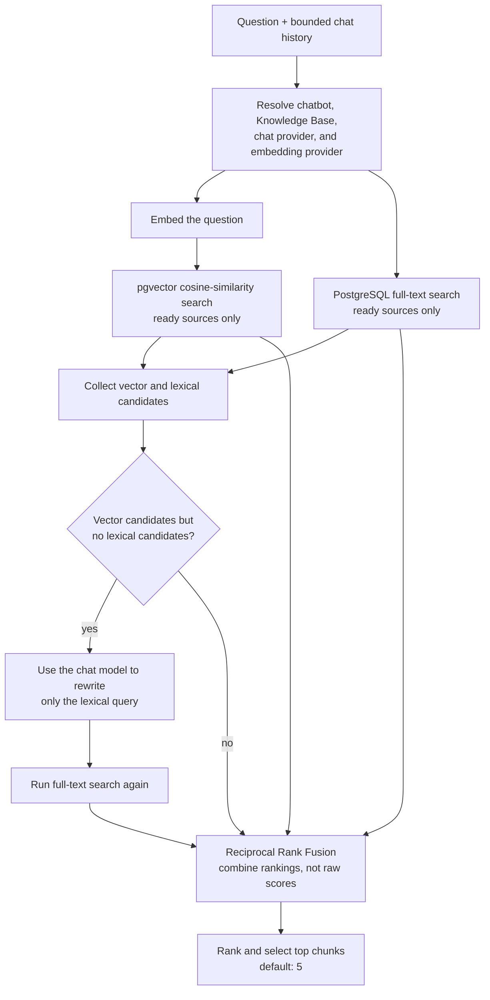
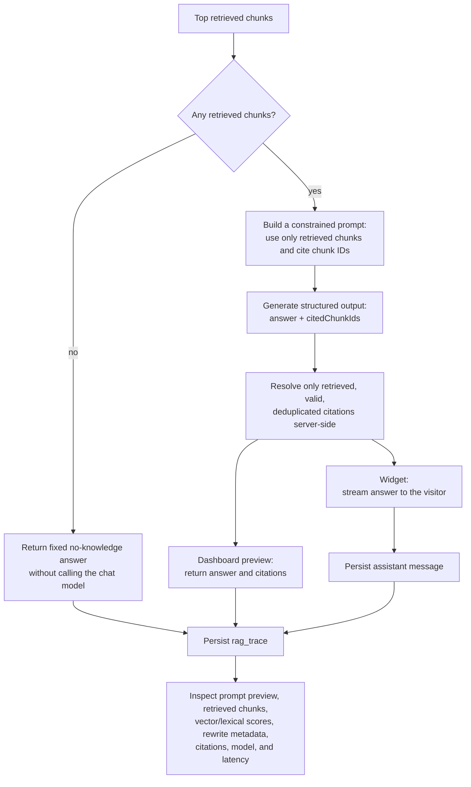

# Geho

Open-source, self-hosted AI chatbots for company websites, with transparent RAG and bring-your-own model providers.

Geho helps teams deploy an embeddable AI chatbot on their own infrastructure. Companies manage agents, knowledge sources, model providers, embed keys, chat logs, and RAG traces from a web dashboard, then install the chatbot on their website through a React component.

Unlike closed chatbot SaaS tools, Geho is designed around control and inspectability: teams can see what documents were indexed, how they were chunked, which chunks were retrieved, what prompt was sent, which model answered, and which sources were cited.

## Why Geho?

Many teams want an AI support chatbot, but do not want to send their knowledge base, model provider credentials, and customer conversations into a black-box SaaS product.

Geho is built for teams that want:

- **Self-hosting**: deploy on your own infrastructure with Docker.
- **Transparent RAG**: inspect sources, chunks, retrieval scores, prompts, and citations.
- **BYO model provider**: use OpenAI, Anthropic, Gemini, OpenRouter, DeepSeek, Ollama, vLLM, or any OpenAI-compatible endpoint.
- **Embeddable website chat**: install with the React ChatWidget.
- **Developer-first integration**: own the backend, database, widget behavior, and deployment path.
- **Business control**: keep model provider keys, documents, and chat logs under your control.

## Product Overview

Geho is a B2B AI chatbot platform for company websites.

The core flow:

```txt
Admin dashboard
  -> configure model provider
  -> create knowledge base
  -> add and index knowledge sources
  -> create chatbot with a chat model provider and knowledge base
  -> inspect chunks and RAG traces
  -> generate public embed key
  -> install widget on company website
  -> visitors ask questions
  -> chatbot answers with citations
```

Geho is not trying to be a general AI workflow platform. It is focused on one job:

> A self-hosted website chatbot that makes RAG transparent and debuggable.

## Tech Stack

Geho should be optimized for self-hosting first.

Recommended stack:

```txt
Monorepo:         pnpm + Turborepo
Language:         TypeScript
Dashboard:        Vite + React
Dashboard Router: TanStack Router
Server State:     TanStack Query
API Server:       Hono on Node.js
Worker:           Node.js background worker
Database:         PostgreSQL
Vector Search:    pgvector
ORM:              Drizzle ORM
Queue:            Redis + BullMQ
Auth:             Better Auth
Widget:           Vite library build, Shadow DOM
Deployment:       Docker Compose first
```

Why this stack:

- PostgreSQL + pgvector keeps relational metadata, chunks, chat logs, and vectors easy to inspect and back up.
- Hono on Node.js keeps the API lightweight while remaining self-host friendly.
- Vite keeps the dashboard a lightweight static client while Hono remains the
  single server-side application.
- TanStack Router provides type-safe dashboard routes and protected layouts,
  while TanStack Query manages API-backed server state.
- Redis + BullMQ keeps ingestion, scraping, chunking, and embedding out of request/response paths.
- A React widget makes the chatbot usable on most modern websites.

## Monorepo Structure

```txt
apps/
  dashboard      # Vite + React admin console
  api            # Hono API server
  worker         # Ingestion, embedding, dispatching jobs

packages/
  ai             # Chat and embedding model provider adapters
  api-client     # Hono api client
  auth           # Better Auth server and client
  crypto         # Encryption and decryption
  db             # Drizzle schemas, PostgreSQL db client
  queue          # BullMQ Worker and Queue factory functions
  rag            # Chunking, prompt assembly, citations
  shared         # Chat and embedding model configurations
  ui             # Shared UI components
  widget-react   # React ChatWidget wrapper
```

## Core Concepts

### Organization

Geho uses the Better Auth organization plugin as its company and tenant model.
An Organization owns Model Provider configs, Knowledge Bases, Chatbots, Embed
Keys, and chat logs. Better Auth members link Dashboard users to
Organizations; Geho does not maintain an additional tenant or membership
model.

### Chatbot

A Chatbot is the website-facing AI assistant. It contains system instructions,
theme settings, retrieval settings, one chat Model Provider, and one Knowledge Base.
Multiple Chatbots can reuse the same Knowledge Base and its indexed vectors.

### Model Provider

A Model Provider stores one capability-specific configuration needed to call a
model provider:

```txt
capability: chat | embedding
provider
base_url
api_key
model_id
```

Model Provider keys must be encrypted at rest and never exposed to the browser
widget.

### Knowledge Base

A Knowledge Base is an Organization-owned, reusable collection of Knowledge
Sources. It selects one embedding Model Provider, and every source chunk and
visitor question in that Knowledge Base must use the same embedding model and
vector space.

A Knowledge Base can contain many Knowledge Sources and can be reused by many
Chatbots. A Chatbot uses exactly one Knowledge Base in the MVP.

The embedding Model Provider association is immutable after Knowledge Base
creation, and an embedding Model Provider's model configuration is immutable
while a Knowledge Base references it. To use a different embedding Model
Provider or model, create a new Model Provider and Knowledge Base, then ingest
the Sources again. This keeps every Knowledge Chunk in a Knowledge Base within
one vector space without maintaining multiple index versions.

### Knowledge Source

A Knowledge Source is one original piece of content inside a Knowledge Base.
Sources belong to the Knowledge Base rather than directly to a Chatbot.

Supported source types:

```txt
text
```

Future source types:

```txt
url
file
sitemap
notion
github
zendesk
intercom
confluence
```

### Knowledge Chunk

A Knowledge Chunk is a deterministic segment of a Knowledge Source. It stores
both the segment content and its vector embedding because the MVP fixes one
immutable embedding Model Provider and model per Knowledge Base. Chunks are written
only after their embeddings have been generated and validated.

### RAG Trace

A RAG trace records the answer path:

```txt
question
retrieved chunks
retrieval scores
prompt preview
model response
citations
latency
```

This is a core differentiator. Geho should make every answer inspectable.

### Embed Key

Websites should not use secret keys.

Geho should use two key types:

```txt
public embed key: pk_xxx
  Used by browser widgets.
  Can be domain-restricted and rate-limited.

secret API key: sk_xxx
  Used only for server-to-server integrations.
  Must never be exposed in frontend code.
```

An embed key is an opaque, public identifier for one Chatbot deployment. It
does not encode a Chatbot or Organization ID. Geho generates the key, stores
only its deterministic SHA-256 hash and a display-safe prefix, and returns the
raw key once so it can be installed in a website. A Chatbot may have multiple
keys for production, staging, local development, or key rotation.



The two directions are intentionally different:

```txt
creation: raw key -> SHA-256 -> stored keyHash
request:  raw key -> SHA-256 -> keyHash lookup -> assigned Chatbot
```

The raw `pk_*` value is browser-visible and is not a server secret. Its
capabilities must therefore remain limited to public Widget APIs and be
protected with tenant isolation, domain policy, revocation, and rate limiting.
Model Provider credentials and dashboard APIs must never be accessible through an
embed key.

## Minimal Database Model

Initial entities:

```txt
user
organization
member

chatbot
model_provider
knowledge_base
knowledge_source
knowledge_chunk

embed_key
chat_session
chat_message
rag_trace
usage_event
```

Current and planned tenant relationships:



The Better Auth Organization is the tenant boundary. Direct tenant keys and
tenant-scoped foreign keys prevent a Model Provider, Knowledge Base, Chatbot,
or RAG record from being associated across Organizations.

## Widget Integration

### React

```tsx
import { ChatWidget } from "@geho/widget-react";

export function App() {
  return (
    <ChatWidget
      apiUrl="xxxx"
      embedKey="pk_xxx"
    />
  );
}
```

## Reliable Ingestion Pipeline

Creating a source succeeds once PostgreSQL durably records both the source and
its ingestion request. Redis availability does not affect the API response;
the Worker delivers the request and processes it asynchronously.



The Dispatcher can safely retry after a crash between BullMQ acceptance and
outbox deletion because `sourceId` is the stable BullMQ job ID. The Worker also
uses job ownership fencing so stale executions cannot overwrite a newer result.

## RAG Pipeline

Once a source is `ready`, its chunks are available to the retrieval and answer
pipeline.

### Hybrid Retrieval



### Grounded Answer and Observability



The Worker owns reliable source ingestion. The API owns tenant-scoped retrieval,
answer orchestration, and trace persistence. `packages/rag` contains the
provider-agnostic RAG primitives—chunking, prompt preparation, and citation
resolution—while `packages/ai` provides the model adapters. This keeps the
pipeline transparent without hiding it behind a large framework.

## Self-Hosting Goal

The target setup should eventually be:

```bash
git clone https://github.com/yzy98/geho.git
cd geho
cp .env.example .env
colima start
pnpm infra:up
pnpm infra:check
pnpm dev
```

Then open:

```txt
http://localhost:3000
```

The local stack should include:

```txt
dashboard
api
worker
postgres + pgvector
redis
```

## Local Development Flow

Geho uses Colima and Docker Compose for local infrastructure, while app code
runs through pnpm and Turborepo on the host machine.

```txt
Colima / Docker Compose
  -> PostgreSQL + pgvector
  -> Redis

pnpm / Turborepo
  -> dashboard (Vite on localhost:3000)
  -> api (Hono on localhost:4000)
  -> worker
  -> packages
```

The dashboard and API use a same-origin path contract:

```txt
/       -> dashboard
/api/*  -> Hono API
```

During local development, the Vite development server proxies `/api` to the
Hono API on `http://localhost:4000`. The dashboard calls relative `/api` URLs,
including Better Auth at `/api/auth/*`, so authentication cookies remain
same-origin and the browser client does not depend on cross-origin cookie
configuration.

In production, a reverse proxy or the self-host deployment serves the static
dashboard and forwards `/api/*` to Hono under the same public origin.

Start a development session:

```bash
colima start
pnpm infra:up
pnpm infra:check
pnpm dev
```

Useful infrastructure commands:

```bash
pnpm infra:ps          # Show running containers
pnpm infra:logs        # Follow infrastructure logs
pnpm infra:postgres    # Open psql for the local Geho database
pnpm infra:redis       # Open redis-cli
pnpm infra:down        # Stop containers but keep local data
```

End a development session:

```bash
pnpm infra:down
colima stop
```

Reset local infrastructure data only when you intentionally want to delete the
local PostgreSQL and Redis volumes:

```bash
pnpm infra:reset:danger
```

Colima is the recommended local runtime for macOS development, but it is not a
hard project dependency. Developers using Docker Desktop can still use the same
`pnpm infra:*` scripts.
