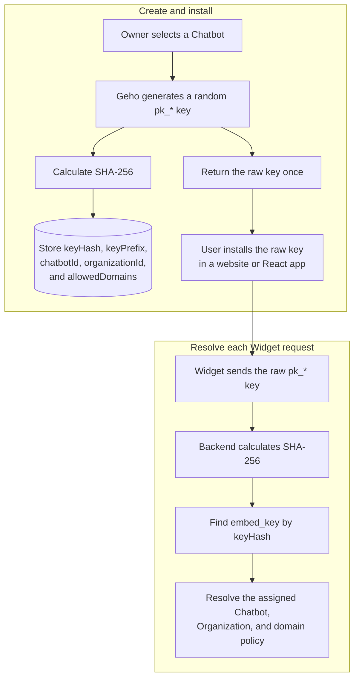
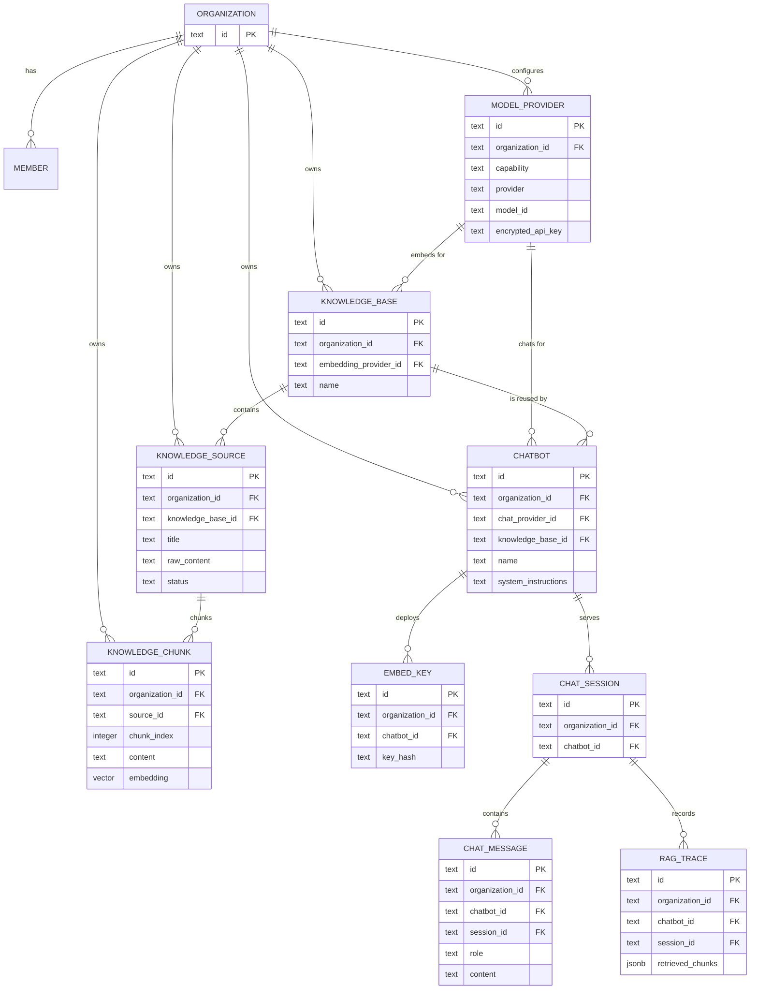

# Geho

Open-source, self-hosted AI chatbots for company websites, with transparent RAG and bring-your-own model providers.

Geho helps teams deploy an embeddable AI chatbot on their own infrastructure. Companies manage agents, knowledge sources, model providers, embed keys, chat logs, and RAG traces from a web dashboard, then install the chatbot on their website through a script tag, React component, or SDK.

Unlike closed chatbot SaaS tools, Geho is designed around control and inspectability: teams can see what documents were indexed, how they were chunked, which chunks were retrieved, what prompt was sent, which model answered, which sources were cited, and how many tokens were used.

## Why Geho?

Many teams want an AI support chatbot, but do not want to send their knowledge base, model provider credentials, and customer conversations into a black-box SaaS product.

Geho is built for teams that want:

- **Self-hosting**: deploy on your own infrastructure with Docker.
- **Transparent RAG**: inspect sources, chunks, retrieval scores, prompts, citations, and token usage.
- **BYO model provider**: use OpenAI, Anthropic, Gemini, OpenRouter, DeepSeek, Ollama, vLLM, or any OpenAI-compatible endpoint.
- **Embeddable website chat**: install with a lightweight script, React component, or headless SDK.
- **Developer-first integration**: own the backend, database, widget behavior, and deployment path.
- **Business control**: keep model provider keys, documents, chat logs, and usage data under your control.

## Product Overview

Geho is a B2B AI chatbot platform for company websites.

The core flow:

```txt
Admin dashboard
  -> configure model provider
  -> create knowledge base
  -> add and index knowledge sources
  -> create chatbot with a chat model provider and knowledge base
  -> inspect chunks and RAG traces
  -> generate public embed key
  -> install widget on company website
  -> visitors ask questions
  -> chatbot answers with citations
```

Geho is not trying to be a general AI workflow platform. It is focused on one job:

> A self-hosted website chatbot that makes RAG transparent and debuggable.

## MVP

The first MVP should prove one thing:

> A company can self-host a website AI chatbot and clearly understand why each answer was generated.

### MVP User Flow

1. Admin starts the app locally or on a server.
2. Admin signs in to the dashboard.
3. Admin configures chat and embedding Model Provider capabilities.
4. Admin creates a Knowledge Base with one embedding Model Provider.
5. Admin adds a text or URL Knowledge Source to the Knowledge Base.
6. Geho chunks the content, embeds it, and stores it.
7. Admin creates a Chatbot with one chat Model Provider and one Knowledge Base.
8. Admin inspects indexed chunks in the dashboard.
9. Admin generates a public Embed Key.
10. Company website installs the Chatbot widget.
11. A visitor asks a question.
12. The backend embeds the question with the Knowledge Base's embedding model
    and retrieves relevant chunks.
13. The Chatbot's chat model answers with source citations.
14. The Dashboard shows chat logs, retrieved chunks, prompt preview, and token
    usage.

### MVP Includes

- Dashboard authentication
- Organization and member foundation
- Chatbot creation and configuration
- Reusable Knowledge Bases
- OpenAI-compatible model provider configuration
- Text and URL knowledge sources
- Chunking and embeddings
- Vector retrieval
- Floating website chatbot widget
- Public embed key with domain allowlist
- Chat sessions and messages
- Source citations
- RAG trace viewer
- Token and usage events
- Docker Compose self-host setup

### MVP Does Not Include

- Workflow canvas
- Multi-agent orchestration
- Human support handoff
- Ticketing system
- Slack, Discord, WhatsApp, or email channels
- Advanced PDF/DOCX parsing
- Fine-tuning
- Hosted cloud billing
- Complex enterprise RBAC
- Agent marketplace

## Tech Stack

Geho should be optimized for self-hosting first.

Recommended stack:

```txt
Monorepo:         pnpm + Turborepo
Language:         TypeScript
Dashboard:        Vite + React
Dashboard Router: TanStack Router
Server State:     TanStack Query
API Server:       Hono on Node.js
Worker:           Node.js background worker
Database:         PostgreSQL
Vector Search:    pgvector
ORM:              Drizzle ORM
Queue:            Redis + BullMQ
File Storage:     S3-compatible storage, MinIO for local self-host
Auth:             Better Auth
Widget:           Vite library build, Shadow DOM
React Package:    React chatbot component
SDK:              Typed TypeScript client
Deployment:       Docker Compose first
```

Why this stack:

- PostgreSQL + pgvector keeps relational metadata, chunks, chat logs, and vectors easy to inspect and back up.
- Hono on Node.js keeps the API lightweight while remaining self-host friendly.
- Vite keeps the dashboard a lightweight static client while Hono remains the
  single server-side application.
- TanStack Router provides type-safe dashboard routes and protected layouts,
  while TanStack Query manages API-backed server state.
- Redis + BullMQ keeps ingestion, scraping, chunking, and embedding out of request/response paths.
- S3-compatible storage lets teams use local MinIO, AWS S3, Cloudflare R2, Tigris, or similar storage.
- A vanilla widget plus React wrapper makes the chatbot usable on almost any website.

## Monorepo Structure

```txt
apps/
  dashboard      # Vite + React admin console
  api            # Hono API server
  worker         # Ingestion, embedding, indexing jobs

packages/
  api-client     # Hono api client
  auth           # Better Auth server and client
  db             # Drizzle schema and migrations
  ai             # Chat and embedding model provider adapters
  rag            # Chunking, retrieval, prompt assembly, citations
  widget-react   # React ChatWidget wrapper
  ui             # Shared UI components
```

## Core Concepts

### Organization

Geho uses the Better Auth organization plugin as its company and tenant model.
An Organization owns Model Provider configs, Knowledge Bases, Chatbots, Embed
Keys, chat logs, and usage. Better Auth members link Dashboard users to
Organizations; Geho does not maintain an additional tenant or membership
model.

### Chatbot

A Chatbot is the website-facing AI assistant. It contains system instructions,
theme settings, retrieval settings, one chat Model Provider, and one Knowledge Base.
Multiple Chatbots can reuse the same Knowledge Base and its indexed vectors.

### Model Provider

A Model Provider stores one capability-specific configuration needed to call a
model provider:

```txt
capability: chat | embedding
provider
base_url
api_key
model_id
```

Model Provider keys must be encrypted at rest and never exposed to the browser
widget.

### Knowledge Base

A Knowledge Base is an Organization-owned, reusable collection of Knowledge
Sources. It selects one embedding Model Provider, and every source chunk and
visitor question in that Knowledge Base must use the same embedding model and
vector space.

A Knowledge Base can contain many Knowledge Sources and can be reused by many
Chatbots. A Chatbot uses exactly one Knowledge Base in the MVP.

The embedding Model Provider association is immutable after Knowledge Base
creation, and an embedding Model Provider's model configuration is immutable
while a Knowledge Base references it. To use a different embedding Model
Provider or model, create a new Model Provider and Knowledge Base, then ingest
the Sources again. This keeps every Knowledge Chunk in a Knowledge Base within
one vector space without maintaining multiple index versions.

### Knowledge Source

A Knowledge Source is one original piece of content inside a Knowledge Base.
Sources belong to the Knowledge Base rather than directly to a Chatbot.

MVP source types:

```txt
text
url
```

Future source types:

```txt
file
sitemap
notion
github
zendesk
intercom
confluence
```

### Knowledge Chunk

A Knowledge Chunk is a deterministic segment of a Knowledge Source. It stores
both the segment content and its vector embedding because the MVP fixes one
immutable embedding Model Provider and model per Knowledge Base. Chunks are written
only after their embeddings have been generated and validated.

### RAG Trace

A RAG trace records the answer path:

```txt
question
retrieved chunks
retrieval scores
prompt preview
model response
citations
token usage
latency
```

This is a core differentiator. Geho should make every answer inspectable.

### Embed Key

Websites should not use secret keys.

Geho should use two key types:

```txt
public embed key: pk_xxx
  Used by browser widgets.
  Can be domain-restricted and rate-limited.

secret API key: sk_xxx
  Used only for server-to-server integrations.
  Must never be exposed in frontend code.
```

An embed key is an opaque, public identifier for one Chatbot deployment. It
does not encode a Chatbot or Organization ID. Geho generates the key, stores
only its deterministic SHA-256 hash and a display-safe prefix, and returns the
raw key once so it can be installed in a website. A Chatbot may have multiple
keys for production, staging, local development, or key rotation.



The two directions are intentionally different:

```txt
creation: raw key -> SHA-256 -> stored keyHash
request:  raw key -> SHA-256 -> keyHash lookup -> assigned Chatbot
```

The raw `pk_*` value is browser-visible and is not a server secret. Its
capabilities must therefore remain limited to public Widget APIs and be
protected with tenant isolation, domain policy, revocation, and rate limiting.
Model Provider credentials and dashboard APIs must never be accessible through an
embed key.

## Minimal Database Model

Initial entities:

```txt
user
organization
member

chatbot
model_provider
knowledge_base
knowledge_source
knowledge_chunk

embed_key
chat_session
chat_message
rag_trace
usage_event
```

Current and planned tenant relationships:



The Better Auth Organization is the tenant boundary. Direct tenant keys and
tenant-scoped foreign keys prevent a Model Provider, Knowledge Base, Chatbot,
or RAG record from being associated across Organizations.

## Widget Integration

### Script Tag

```html
<script
  src="https://cdn.example.com/geho-widget.js"
  data-chatbot-key="pk_xxx"
  data-position="bottom-right"
></script>
```

### React

```tsx
import { ChatWidget } from "@geho/widget-react";

export function App() {
  return (
    <ChatWidget
      apiUrl="xxxx" 
      embedKey="pk_xxx"
    />
  );
}
```

### Headless SDK

```ts
import { createGehoClient } from "@geho/sdk";

const geho = createGehoClient({
  chatbotKey: "pk_xxx",
});

const response = await geho.chat.sendMessage({
  sessionId: "session_xxx",
  message: "How do I reset my password?",
});
```

## Security Principles

- Public embed keys must support domain allowlists.
- Model Provider API keys must be encrypted at rest.
- Widget requests must be rate-limited.
- Chatbot access must be scoped by embed key.
- Admin APIs must require authenticated organization membership.
- RAG traces must never leak data across organizations.
- Secret API keys must only be used server-side.

## RAG Pipeline

MVP pipeline:

```txt
source input
  -> normalize
  -> chunk
  -> embed
  -> store chunk metadata in PostgreSQL
  -> store vector in pgvector
  -> retrieve by question embedding
  -> assemble prompt
  -> call model provider
  -> return answer with citations
  -> save trace and usage
```

The pipeline should be implemented directly in `packages/rag` rather than hidden behind a large framework. LangChain or LlamaIndex can be optional adapters later, but transparent RAG should remain a first-class internal design goal.

## Self-Hosting Goal

The target setup should eventually be:

```bash
git clone https://github.com/yzy98/geho.git
cd geho
cp .env.example .env
colima start
pnpm infra:up
pnpm infra:check
pnpm dev
```

Then open:

```txt
http://localhost:3000
```

The local stack should include:

```txt
dashboard
api
worker
postgres + pgvector
redis
minio
```

## Local Development Flow

Geho uses Colima and Docker Compose for local infrastructure, while app code
runs through pnpm and Turborepo on the host machine.

```txt
Colima / Docker Compose
  -> PostgreSQL + pgvector
  -> Redis

pnpm / Turborepo
  -> dashboard (Vite on localhost:3000)
  -> api (Hono on localhost:4000)
  -> worker
  -> packages
```

The dashboard and API use a same-origin path contract:

```txt
/       -> dashboard
/api/*  -> Hono API
```

During local development, the Vite development server proxies `/api` to the
Hono API on `http://localhost:4000`. The dashboard calls relative `/api` URLs,
including Better Auth at `/api/auth/*`, so authentication cookies remain
same-origin and the browser client does not depend on cross-origin cookie
configuration.

In production, a reverse proxy or the self-host deployment serves the static
dashboard and forwards `/api/*` to Hono under the same public origin.

Start a development session:

```bash
colima start
pnpm infra:up
pnpm infra:check
pnpm dev
```

Useful infrastructure commands:

```bash
pnpm infra:ps          # Show running containers
pnpm infra:logs        # Follow infrastructure logs
pnpm infra:postgres    # Open psql for the local Geho database
pnpm infra:redis       # Open redis-cli
pnpm infra:down        # Stop containers but keep local data
```

End a development session:

```bash
pnpm infra:down
colima stop
```

Reset local infrastructure data only when you intentionally want to delete the
local PostgreSQL and Redis volumes:

```bash
pnpm infra:reset:danger
```

Colima is the recommended local runtime for macOS development, but it is not a
hard project dependency. Developers using Docker Desktop can still use the same
`pnpm infra:*` scripts.

## Business Model

Geho can be open-source while still supporting a commercial business.

Recommended model:

### Open-source Core

- Self-hosted dashboard
- Chatbot widget
- Basic RAG
- BYO model provider
- Basic traces
- Basic usage tracking

### Paid Cloud

- Hosted infrastructure
- Managed database and vector store
- Backups and upgrades
- Monitoring
- Higher limits
- Managed file parsing

### Enterprise

- SSO/SAML
- Advanced RBAC
- Audit logs
- Data retention policies
- PII redaction
- Advanced analytics
- SLA support
- Private deployment support
- Custom integrations

## Positioning

Geho is not:

- a closed chatbot SaaS
- a generic workflow builder
- a multi-agent playground
- a black-box RAG product

Geho is:

> An open-source, self-hosted AI chatbot platform for company websites, with transparent RAG, BYO model providers, and embeddable widgets.

## Status

This repository has moved past planning into an authenticated Dashboard MVP.

Current checkpoint:

```txt
local self-host dev stack
  -> dashboard login
  -> organization onboarding
  -> configure chat and embedding model providers
  -> create reusable knowledge base
  -> add text knowledge source
  -> chunk, embed, and store vectors in pgvector
  -> preview retrieval from the dashboard
  -> create chatbot with chat model provider + knowledge base
  -> ask the chatbot from the dashboard
  -> receive answer, citations, and traceId
  -> save rag_trace with retrieved chunks, prompt preview, model, latency, and citations
```

Minimal RAG is complete for the authenticated Dashboard preview path. Public
widget chat, chat sessions/messages, URL ingestion, trace detail UI, and token
usage accounting are intentionally deferred until after this checkpoint.

## Development Plan

The current development process is checkpoint-driven rather than a fixed
two-week calendar. The priority is a narrow, inspectable RAG loop before
expanding into public widget delivery.

Current milestone:

```txt
model provider setup
  -> reusable knowledge base
  -> text source ingestion
  -> retrieval preview
  -> chatbot ask preview
  -> rag_trace persistence
```

Each checkpoint should end with:

- A locally runnable product path.
- A visible Dashboard acceptance result.
- Tenant isolation preserved through authenticated Organization membership.
- Relevant `typecheck` and `build` commands passing.

Database schemas are introduced by the vertical slice that first needs them.
For production or shared environments, schema changes must be paired with the
project's chosen Drizzle rollout path: generated migrations or an explicit
`drizzle-kit push` workflow.

### Checkpoint 1: Project Skeleton

- [x] Scaffold monorepo basic skeleton.
- [x] Configure typescript, turbo, biome and zed setting.
- [x] Add root scripts and verify.

### Checkpoint 2: Local Runtime && Database foundation

- [x] Add Docker Compose for local self-hosting:
  - [x] PostgreSQL with pgvector
  - [x] Redis
- [x] Set up `.env` and `.env.example` with required local variables.
- [x] Confirm the local stack boots and services can reach PostgreSQL and Redis.
- [x] Init `packages/db` using drizzle ORM and PostgreSQL.
- [x] Add db related scripts: push, generate, migrate and studio.
- [x] Create simple table and apply changes to local database
- [x] Replace test `users` table with [Better-Auth](https://better-auth.com/docs/installation#create-database-tables) required schemas.
- [x] Add [organization-related schemas](https://better-auth.com/docs/plugins/organization#schema).
- [x] Draw ERD and implement `modelProvider` and `chatbot` schemas.

### Checkpoint 3: Auth and Organization Onboarding

- [x] Add the Hono API and Vite + React dashboard app foundations.
- [x] Configure TanStack Router, TanStack Query, and the local `/api` proxy.
- [x] Configure Better Auth on the API with the existing Drizzle schemas.
- [x] Add the Better Auth route handler and dashboard auth client.
- [x] Add a minimal email/password sign-up and sign-in page.
- [x] Add explicit Organization onboarding after sign-up/sign-in:
  - [x] `GET /organizations/current` is read-only and never creates data.
  - [x] A signed-in user without an Organization is redirected to an
        Organization onboarding page.
  - [x] The onboarding form collects Organization `name` and `slug`.
  - [x] `POST /organizations` creates the initial Organization through the
        Better Auth organization plugin.
  - [x] The creator becomes the Organization `owner`.
  - [x] Repeated or concurrent creation requests do not create duplicates.
- [x] Restrict MVP organization membership roles to:
  - [x] `owner`
  - [x] `member`
- [x] Add authenticated `/organizations/current`.
- [x] Derive the current organization from the authenticated Better Auth
      membership; never trust a client-provided organization ID.
- [x] Add authenticated `POST /organizations`:
  - [x] Validate `name` and `slug`.
  - [x] Enforce the MVP single-Organization initialization rule.
  - [x] Use server-side `auth.api.createOrganization` with `userId`; do not
        insert `organization` or `member` rows manually.
- [x] Show the current organization in the dashboard shell after onboarding.
- [x] Acceptance:
  - [x] A new user can sign up, sign in, fill Organization onboarding, and see
        the created Organization.
  - [x] A returning user with membership sees their current Organization.
  - [x] A signed-in user without membership is redirected to onboarding or a
        membership-required state.
  - [x] An unauthenticated request to `/organizations/current` is rejected.
  - [x] `GET /organizations/current` does not create an Organization.
  - [x] Duplicate or concurrent `POST /organizations` calls do not create
        duplicate Organizations.
- [x] Run:
  - [x] `pnpm check`
  - [x] `pnpm typecheck`
  - [x] Relevant auth and organization tests.

### Checkpoint 4: Model Provider Setup

- [x] Define supported chat and embedding model catalogs shared by the API and
      dashboard.
- [x] Model one `model_provider` row as one capability and credential:
  - [x] `chat`
  - [x] `embedding`
- [x] Store the Model Provider name, implementation, model ID, optional custom
      base URL, and encrypted API key.
- [x] Pass custom base URLs to AI SDK provider factories while preserving each
      provider's default URL when none is configured.
- [x] Encrypt Model Provider API keys with `APP_ENCRYPTION_KEY` using compact
      JWE, direct encryption, and `A256GCM`.
- [x] Add authenticated Model Provider APIs:
  - [x] `GET /model-providers`
  - [x] `POST /model-providers`
- [x] Derive `organizationId` from the authenticated user's membership; never
      accept it from the dashboard.
- [x] Allow all organization members to list Model Providers and restrict
      creation to the organization `owner`.
- [x] Return safe Model Provider projections without API keys, encrypted
      credentials, or organization IDs.
- [x] Add the dashboard Models list, empty/loading/error states, and responsive
      creation dialog.
- [x] Infer dashboard request and response types from the Hono client and
      invalidate the organization-scoped Model Provider query after creation.
- [x] Acceptance:
  - [x] An owner can create chat and embedding Model Provider configurations.
  - [x] Members can list Model Providers but cannot create them.
  - [x] Model Provider credentials are encrypted at rest and never returned to
        the dashboard.
  - [x] Model Provider reads and writes are scoped to the authenticated user's
        organization.
- [x] Run:
  - [x] `pnpm check`
  - [x] `pnpm typecheck`
  - [x] Model Provider API, encryption, authorization, and tenant-isolation
        tests.

Chatbot API and dashboard work are intentionally deferred to Checkpoint 5.

### Checkpoint 5: Chatbot Setup

- [x] Add the initial `chatbot` schema with capability-specific Model Provider
      references:
  - [x] `chat_provider_id`
  - [x] `embedding_provider_id`
- [x] Remove duplicated chat and embedding model fields from `chatbot`; each
      selected Model Provider row already owns its capability, model ID, and
      credential.
- [x] Preserve Chatbots when a referenced Model Provider is deleted by setting
      the corresponding Model Provider reference to `null`.
- [x] Add authenticated Chatbot APIs:
  - [x] `GET /chatbots`
  - [x] `POST /chatbots`
- [x] Derive `organizationId` from the authenticated user's membership; never
      accept it from the dashboard.
- [x] Allow all organization members to list Chatbots and restrict creation to
      the organization `owner`.
- [x] Validate that selected Model Providers:
  - [x] Belong to the current organization.
  - [x] Match the required `chat` or `embedding` capability.
- [x] Add the dashboard Chatbot list, empty/loading/error states, and responsive
      creation form.
- [x] Limit the first Chatbot slice to create and list; defer update, delete,
      model execution, RAG, and widget behavior.
- [x] Acceptance:
  - [x] An owner can create a Chatbot using chat and embedding Model Providers
        from the current organization.
  - [x] Members can list Chatbots but cannot create them.
  - [x] Cross-organization and capability-mismatched Model Provider references
        are rejected.
  - [ ] Chatbot responses do not expose Model Provider credentials or
        organization IDs.
- [x] Run:
  - [x] `pnpm check`
  - [x] `pnpm typecheck`
  - [x] Chatbot API, authorization, capability, and tenant-isolation tests.

Checkpoint 7 supersedes the initial embedding ownership above: Embedding
Model Providers now belong to reusable Knowledge Bases, and Chatbots reference a
Knowledge Base instead of storing `embedding_provider_id`.

### Checkpoint 6: Embed Keys and Domain Allowlist

- [x] Add the `embed_key` schema with direct Organization and Chatbot
      ownership.
- [x] Generate random `pk_*` public embed keys with 32 bytes of entropy.
- [x] Store SHA-256 key hashes, not raw keys.
- [x] Store display-safe key prefixes.
- [x] Add an optional exact-origin domain allowlist per key.
- [x] Allow one Chatbot to own multiple keys for separate deployments and key
      rotation.
- [x] Add authenticated, Chatbot-scoped Embed Key APIs:
  - [x] `GET /chatbots/:chatbotId/embed-keys`
  - [x] `POST /chatbots/:chatbotId/embed-keys`
- [x] Do not add a global `GET /embed-keys` endpoint or a single-key read
      endpoint for the MVP.
- [x] Derive `organizationId` from membership and validate that the selected
      Chatbot belongs to that Organization.
- [x] Allow all Organization members to list a selected Chatbot's key
      summaries and restrict creation to the Organization `owner`.
- [x] Add Embed Key management dialog to the Chatbot card instead of adding a global Embed Key
      dashboard page.
- [x] Load keys only for the selected Chatbot using an Organization- and
      Chatbot-scoped Dashboard query.
- [x] Show the raw key once after creation, then retain only its prefix in the
      management UI.
- [ ] Show local Script Widget and React integration snippets for the selected
      Chatbot.
- [ ] Add owner-only key revocation without exposing the raw key again.
- [x] Acceptance:
  - [x] An owner can create multiple keys for a Chatbot from that Chatbot's
        management UI.
  - [x] A key is displayed once after creation.
  - [x] Only its hash and prefix remain stored and returned by later list
        requests.
  - [x] Listing one Chatbot's keys never returns keys assigned to another
        Chatbot or Organization.
  - [x] A raw key resolves only to its assigned Chatbot and Organization.
  - [x] Members can view key summaries but cannot create or revoke keys.
- [x] Run:
  - [x] `pnpm check`
  - [x] `pnpm typecheck`
  - [ ] Relevant embed key and tenant-isolation tests.

### Checkpoint 7: Reusable Knowledge Base Foundation

- [x] Add the Organization-owned `knowledge_base` schema.
- [x] Give each Knowledge Base one required embedding Model Provider.
- [x] Keep the Knowledge Base embedding Model Provider association immutable
      after creation.
- [x] Enforce tenant-safe Model Provider, Knowledge Base, Chatbot, and Embed Key
      relationships with composite constraints.
- [x] Move embedding ownership from `chatbot.embedding_provider_id` to
      `knowledge_base.embedding_provider_id`.
- [x] Replace the Chatbot creation input `embeddingProviderId` with
      `knowledgeBaseId`.
- [x] Keep one required chat Model Provider per Chatbot.
- [x] Add authenticated Knowledge Base APIs:
  - [x] `GET /knowledge-bases`
  - [x] `POST /knowledge-bases`
- [x] Derive `organizationId` from authenticated membership and reject
      cross-Organization or non-embedding Model Provider references.
- [x] Allow all Organization members to list Knowledge Bases and restrict
      creation to the Organization owner.
- [x] Add the `/knowledge-bases` Dashboard route with:
  - [x] Organization-scoped TanStack Query cache keys.
  - [x] Empty, loading, error, and success states.
  - [x] Owner-only responsive creation form.
  - [x] Embedding Model Provider selection.
  - [x] Contextual navigation to `/models` when no embedding Model Provider
        exists.
- [x] Refactor the Chatbot Dashboard:
  - [x] Replace the Embedding Model Provider field with a Knowledge Base field.
  - [x] Load Knowledge Bases in the Chatbot route.
  - [x] Show the selected Knowledge Base on each Chatbot card.
  - [x] Guide owners to create missing chat models or Knowledge Bases.
- [x] Preserve `/models` as the only place that stores Model Provider
      credentials, Base URLs, and model configuration.
- [x] Acceptance:
  - [x] An owner can create a Knowledge Base before creating a Chatbot.
  - [x] Multiple Chatbots can reference the same Knowledge Base.
  - [x] A Chatbot uses its Knowledge Base's embedding model for future
        retrieval and its own chat Model Provider for answer generation.
  - [x] Members can view Knowledge Bases but cannot create them.
  - [x] Model Provider credentials and Organization IDs are not exposed by
        Knowledge Base responses.
- [x] Run:
  - [x] `pnpm check`
  - [x] `pnpm typecheck`
  - [x] `pnpm build`
  - [ ] Knowledge Base API authorization and tenant-isolation integration
        tests.

### Checkpoint 8: Text Knowledge Source Ingestion

- [x] Add schemas for:
  - [x] `knowledge_source`
  - [x] `knowledge_chunk`
- [x] Add a Knowledge Base-scoped text source API and Dashboard form.
- [x] Support `text` sources.
- [x] Implement deterministic chunking in `packages/rag`.
- [x] Generate Source embeddings through the Knowledge Base's configured
      embedding Model Provider.
- [x] Store each Chunk's content and vector embedding together in
      `knowledge_chunk`.
- [x] Validate the complete embedding batch before writing Knowledge Chunks.
- [x] Mark Sources as `ready` or `failed`; failed ingestion must not leave
      retrievable partial chunks.
- [x] Show pending, processing, ready, and failed states in the dashboard.
- [x] Acceptance:
  - [x] An owner can add text to a Knowledge Base and see it indexed.
  - [x] Failed ingestion exposes an actionable error.
- [x] Run:
  - [x] `pnpm --filter @geho/api typecheck`
  - [x] `pnpm --filter @geho/api build`
  - [x] `pnpm --filter @geho/dashboard typecheck`
  - [x] `pnpm --filter @geho/dashboard build`

### Checkpoint 9: Dashboard Retrieval Preview

- [x] Add a reusable retrieval module that:
  - [x] Embeds the query with the Knowledge Base's embedding Model Provider.
  - [x] Searches `knowledge_chunk` through pgvector.
  - [x] Restricts retrieval to the selected Organization and Knowledge Base.
  - [x] Returns chunk content, Source title, chunk index, and similarity.
- [x] Add authenticated Dashboard API:
  - [x] `POST /knowledge-bases/:knowledgeBaseId/retrieval-preview`
- [x] Add Dashboard retrieval preview form on a Knowledge Base detail page.
- [x] Show retrieval preview only when at least one Source is `ready`.
- [x] Acceptance:
  - [x] A Dashboard user can ask a retrieval query and inspect returned chunks.
  - [x] Retrieval never crosses Organization or Knowledge Base boundaries.
- [x] Run:
  - [x] `pnpm --filter @geho/api typecheck`
  - [x] `pnpm --filter @geho/api build`
  - [x] `pnpm --filter @geho/dashboard typecheck`
  - [x] `pnpm --filter @geho/dashboard build`

### Checkpoint 10: Dashboard Chatbot Ask Preview

- [x] Add `rag_trace` schema for Dashboard RAG preview traces.
- [x] Assemble the RAG prompt with retrieved chunk IDs, Source titles, chunk
      indexes, scores, and content.
- [x] Call the Chatbot's chat Model Provider with structured output:
  - [x] `answer`
  - [x] `citedChunkIds`
- [x] Filter citations server-side so only actually retrieved chunks can be
      cited.
- [x] Save `rag_trace` in the same request lifecycle:
  - [x] `question`
  - [x] `answer`
  - [x] `promptPreview`
  - [x] `model`
  - [x] `latencyMs`
  - [x] `retrievedChunks`
  - [x] `citations`
- [x] Add authenticated Dashboard API:
  - [x] `POST /chatbots/:chatbotId/ask-preview`
- [x] Add Dashboard Chatbot Test dialog that returns:
  - [x] `answer`
  - [x] `citations`
  - [x] `traceId`
- [x] Acceptance:
  - [x] A Dashboard user can ask a single-turn question through a Chatbot and
        receive a cited answer.
  - [x] Multiple Chatbots can reuse the same Knowledge Base vectors.
  - [x] The answer, retrieved chunks, and trace belong to the same Organization,
        Chatbot, and Knowledge Base.
- [x] Run:
  - [x] `pnpm --filter @geho/api typecheck`
  - [x] `pnpm --filter @geho/api build`
  - [x] `pnpm --filter @geho/dashboard typecheck`
  - [x] `pnpm --filter @geho/dashboard build`

### Next: Schema Rollout

- [ ] Decide and document the DB schema rollout path for shared environments:
  - [ ] Generate and commit Drizzle migrations, or
  - [ ] Use an explicit `drizzle-kit push` workflow for the current local MVP.
- [ ] Apply the `rag_trace` schema before testing ask-preview against a fresh
      database.

### Next: Public Chat API with Trace

- [x] Add schemas for:
  - [x] `chat_session`
  - [x] `chat_message`
- [x] Implement:
  - [x] `GET /widget/config?key=pk_xxx`
  - [x] `POST /widget/sessions`
  - [x] `POST /widget/messages`
- [x] Validate the embed key hash.
- [x] Validate the request origin against the domain allowlist.
- [ ] Add basic rate limiting for public widget requests.
- [x] Reuse the Dashboard ask-preview RAG path for visitor messages.
- [x] Store visitor and assistant messages.
- [x] Store public-chat `rag_trace` records linked to the session/message once
      those schemas exist.
- [x] Return:
  - [x] `answer`
  - [x] `citations`
  - [x] `traceId`
- [x] Acceptance:
  - [x] A valid key and allowed origin receive a cited answer.
  - [x] Invalid keys, blocked origins, and rate-limit violations are rejected.
  - [x] No public request can read data from another organization.

### Next: Minimal Website Widget

- [ ] Build the first runnable `packages/widget` slice:
  - [ ] Vanilla JavaScript build.
  - [x] Shadow DOM isolation.
  - [x] Floating button
  - [x] Chat panel
  - [x] Message input
  - [x] Loading state
  - [x] Answer rendering
  - [x] Citations list
  - [x] Error state
- [ ] Load chatbot configuration through the public embed key.
- [ ] Connect the widget to the public chat API.
- [ ] Add local embed snippet support:

  ```html
  <script
    src="http://localhost:3000/widget.js"
    data-chatbot-key="pk_xxx"
  ></script>
  ```

- [ ] Acceptance:
  - [ ] The widget loads on a plain local HTML page.
  - [ ] A visitor can ask a question and see a cited answer.
  - [ ] Loading, API failure, and blocked-domain states are visible.
- [ ] Run:
  - [ ] `pnpm check`
  - [ ] `pnpm typecheck`
  - [ ] `pnpm build`
  - [ ] Widget integration test against the public API.

### Next: Dashboard Observability

- [ ] Add chat logs page.
- [ ] Add RAG trace detail page.
- [ ] Show:
  - [ ] Visitor and assistant messages
  - [ ] Retrieved chunks and scores
  - [ ] Prompt preview
  - [ ] Model and token usage
  - [ ] Latency and citations
- [ ] Add the `usage_event` schema and migration.
- [ ] Record usage events for chat, embedding, retrieval, and ingestion.
- [ ] Acceptance:
  - [ ] An owner can open a widget conversation and inspect why its answer was generated.
  - [ ] Trace and usage queries are restricted to the current organization.
- [ ] Run:
  - [ ] `pnpm check`
  - [ ] `pnpm typecheck`
  - [ ] Relevant trace, usage, and tenant-isolation tests.

### Next: Product Completion Pass

- [ ] Add widget welcome message and basic theme variables.
- [ ] Add dashboard empty states and actionable error states.
- [ ] Complete the onboarding checklist for:
  - [ ] Model configured
  - [ ] Knowledge Base created
  - [ ] Knowledge Source ready
  - [ ] Chatbot created
  - [ ] Embed key created
  - [ ] Widget installed
- [ ] Verify all model provider credentials remain server-only.
- [ ] Verify every admin query derives the current organization from Better
      Auth membership.
- [ ] Acceptance:
  - [ ] A new owner can complete setup without manual database operations.
  - [ ] The dashboard clearly identifies the next incomplete setup step.
- [ ] Run:
  - [ ] `pnpm check`
  - [ ] `pnpm typecheck`
  - [ ] `pnpm build`

### Next: Demo and Self-Host Documentation

- [ ] Add demo assets:
  - [ ] Demo HTML page with widget installed
  - [ ] Sample text knowledge source
- [ ] Add self-host setup docs:
  - [ ] `cp .env.example .env`
  - [ ] `colima start`
  - [ ] `pnpm infra:up`
  - [ ] `pnpm infra:check`
  - [ ] `pnpm db:migrate`
  - [ ] Dashboard URL
  - [ ] Widget demo URL
- [ ] Document required environment variables and secure key generation.
- [ ] Verify the documented setup from a clean local checkout.
- [ ] Acceptance:
  - [ ] A developer can follow the documentation and run the complete demo.
  - [ ] The demo includes a cited answer and an inspectable RAG trace.
- [ ] Run:
  - [ ] `pnpm check`
  - [ ] `pnpm typecheck`
  - [ ] `pnpm build`

### Next: End-to-End Hardening

- [ ] Run acceptance test:
  - [ ] Admin signs in
  - [ ] Default organization is created
  - [ ] Admin saves model provider config
  - [ ] Admin creates Knowledge Base
  - [ ] Admin adds text source to the Knowledge Base
  - [ ] Source is indexed into chunks
  - [ ] Admin creates Chatbot with the Knowledge Base
  - [ ] Admin creates embed key
  - [ ] Widget loads with public key
  - [ ] Visitor asks question
  - [ ] Answer includes citations
  - [ ] Dashboard shows chat log
  - [ ] Dashboard shows RAG trace
  - [ ] Wrong domain is rejected when allowlist is set
- [ ] Test retry and failure paths:
  - [ ] Repeated organization bootstrap
  - [ ] Repeated ingestion job
  - [ ] Model provider failure
  - [ ] Invalid embed key
  - [ ] Cross-organization access attempt
- [ ] Run the complete required checks:
  - [ ] `pnpm check`
  - [ ] `pnpm typecheck`
  - [ ] `pnpm build`
- [ ] Run the full automated test suite.
- [ ] Fix release-blocking issues only.
- [ ] Tag the result as the first local MVP milestone.

### Deferred Until After MVP

- [ ] Streaming responses
- [ ] React package
- [ ] File uploads
- [ ] Sitemap ingestion
- [ ] SSO/SAML
- [ ] Advanced RBAC
- [ ] Billing
- [ ] Hosted cloud
- [ ] Human support handoff
- [ ] Workflow canvas
- [ ] Multi-agent orchestration
